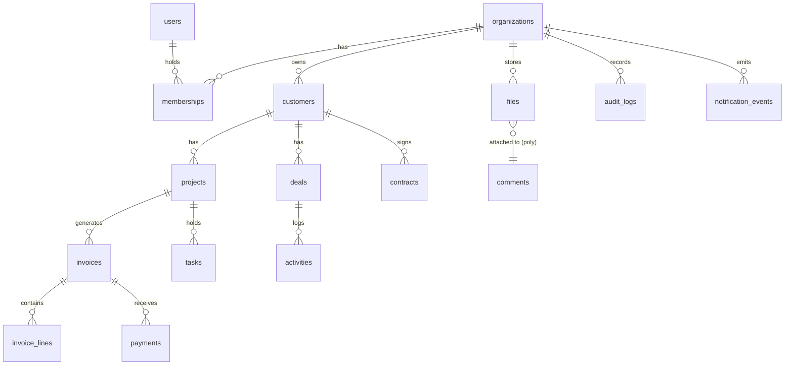

# 業務アプリプラットフォーム 実装仕様書 v1

- 作成日: 2026-05-04
- 親文書: `Document/業務アプリプラットフォーム_構想資料_ダイアグラム思考.md`
- 用途: 各サブエージェント（バックエンド／フロント／DB／DevOps／QA／業種ドメイン）への設計依頼書として使用する
- 編成方針: 「機能モジュール（F-XXX）」単位で、スコープ・ロール・データ・API・UI・状態・権限・イベント・非機能・受け入れ基準を最低限揃える

---

## 0. 本書の使い方

1. 各モジュールには一意の **機能ID `F-XXX`** を付与している。サブエージェントへ依頼するときは「`F-INVOICE` の API と画面を設計して」のようにIDで指示する。
2. 「**スコープ**」欄は `MVP / Phase1 / Phase2 / Phase3+` のいずれか。MVP は最初の β リリースに必須。
3. 各モジュール末尾の「**受け入れ基準（DoD）**」を満たさない設計は差し戻す。
4. §17 のトレーサビリティ表で、構想資料の全14章＋付録＋各章「振り返り(空き)」項目との対応を保証する。仕様変更時は表を必ず更新する。
5. 用語は §16 の用語集に従う。曖昧な略号を独自導入しない。

---

## 1. プロダクト全体像（再掲・実装観点）

- 4層構造: `共通基盤 → 共通アプリ → 業種パック → AI/連携`（構想資料 §3, §14）
- マルチテナント SaaS。テナント分離は **PostgreSQL の RLS** を主、アプリ層は二重防御（構想資料 §6, 付録A）
- ターゲット: 個人事業主／中小企業（5〜50名想定）、業種は `建設 / 士業 / 店舗 / EC小規模` のいずれかから1〜2つを優先攻略（構想資料 §2, §7）
- リリース順: 共通基盤 → 共通3アプリ MVP → クローズドβ → 業種パック → 課金/連携 → 正式版（構想資料 §9）

### 1.1 想定技術スタック（前提・暫定）

サブエージェントは以下を前提に設計する。差替え提案がある場合は明示的に提示すること。

| レイヤ | 採用 | 備考 |
|---|---|---|
| フロント | Next.js (App Router) + TypeScript + React Server Components | PWA 対応 |
| UI | shadcn/ui + Tailwind CSS | デザインシステム単一化 |
| API | Next.js Route Handlers + tRPC または OpenAPI(REST) | 内部 RPC は tRPC、外部公開は REST |
| 認証 | Auth (メール/パスワード + OAuth: Google) + 組織モデル | パスワードレスは Phase2 |
| DB | PostgreSQL 15+ (Supabase or Neon) | RLS 必須 |
| ストレージ | S3 互換（R2 / Supabase Storage） | 署名付き URL 配布 |
| 検索 | Phase1: Postgres 全文検索 / Phase2: Meilisearch（構想資料 §5 振り返り） |
| ジョブ | Vercel Cron + Queue（QStash 等） | 重い処理は別ワーカ |
| 課金 | Stripe（Subscriptions + Connect の可能性） |
| 監視 | Sentry + 構造化ログ + ログ集約（Datadog or Logtail）（構想資料 §5 振り返り） |
| インフラ | Vercel + Supabase / Neon ＋ S3 互換 | DR は §15 参照 |

---

## 2. ロール定義（横断）

構想資料 §4 を実装ロールに落とす。RBAC（F-RBAC）はこのロールを上書き／詳細化する。

| ロールID | 名称 | テナント帰属 | 主な権限 |
|---|---|---|---|
| `OWNER` | オーナー（経営者） | 1 テナントに 1 名以上 | 全データR/W、課金、テナント削除、外部招待 |
| `ADMIN` | 管理者 | テナント内複数可 | ユーザー管理、マスタ編集、承認、外部連携設定 |
| `STAFF` | 一般スタッフ | テナント内複数 | 自分または担当案件の R/W、設定は閲覧のみ |
| `GUEST_CUSTOMER` | ゲスト顧客 | 共有先として | 自分宛の請求書／納品物の閲覧、コメント |
| `EXTERNAL_EXPERT` | 税理士・社労士・ITC等 | 共有先として | 指定フォルダ／請求／月次資料の閲覧、コメント |
| `SYS_OPS` | プラットフォーム運用 | システム横断 | サポート用の閲覧（要本人同意ログ） |

「LINE だけで使う現場アルバイト」（構想資料 §4 振り返り）は **ログイン無し ID（電話番号 or LINE userId 紐付け）** を `STAFF` のサブタイプとして扱う（F-AUTH-LITE）。

---

## 3. 共通基盤モジュール仕様

### F-AUTH 認証・組織

- スコープ: MVP
- 関連: 構想資料 §4, §5, §6
- 概要: メール/パスワード + Google OAuth、テナント（組織）モデル、招待フロー、セッション管理。

#### 3.1 ユースケース
1. メールでサインアップ → 確認メール → 組織新規作成（業種選択へ続く: F-ONBOARDING）
2. 招待リンクから既存組織にジョイン
3. 既存ユーザーが追加組織を作成・切替（複数組織所属）
4. ログアウト・パスワード再設定・MFA（Phase2）

#### 3.2 データモデル（要点）
- `users(id, email, hashed_password?, name, avatar_url, locale, timezone, mfa_enabled, last_login_at)`
- `organizations(id, name, legal_name, country, timezone, plan_id, industry_pack_ids[], created_at)`
- `memberships(id, user_id, organization_id, role, status, invited_by, invited_at, joined_at)`
- `invitations(id, organization_id, email, role, token_hash, expires_at, accepted_at)`
- `sessions(id, user_id, refresh_token_hash, ip, ua, expires_at)`

#### 3.3 API（最低限）
- `POST /auth/signup`
- `POST /auth/login`
- `POST /auth/logout`
- `POST /auth/password/forgot` `POST /auth/password/reset`
- `POST /orgs`（組織作成。同時に作成者を OWNER メンバーシップ化）
- `POST /orgs/{id}/invitations` / `GET /invitations/{token}` / `POST /invitations/{token}/accept`
- `POST /auth/switch-org`（アクティブ組織切替）

#### 3.4 画面
- `/signup` `/login` `/forgot` `/reset`
- `/onboarding/*`（F-ONBOARDING に委譲）
- `/settings/members`
- 組織スイッチャー（共通ヘッダ）

#### 3.5 状態遷移（招待）
`PENDING → ACCEPTED` または `EXPIRED` または `REVOKED`。期限はデフォ7日。

#### 3.6 非機能・セキュリティ
- パスワード Argon2id、ログイン失敗 5 回で 15 分ロック、すべて監査ログ（F-AUDIT）に記録
- 招待トークンは sha256 ハッシュで保存、URL は 1 回限り使用
- レート制限: ログイン 10 req/min/IP、サインアップ 5 req/min/IP

#### 3.7 受け入れ基準（DoD）
- [ ] 1 ユーザーが 2 組織以上に所属し、UI で切替できる
- [ ] 招待 → サインアップ → 自動ジョインが 30 秒以内で完了
- [ ] パスワードハッシュは DB ダンプから直接復元できない
- [ ] すべての認証イベントが監査ログに記録される

---

### F-AUTH-LITE LINE/軽量アクセス（現場アルバイト用）

- スコープ: Phase2（構想資料 §4 振り返り「LINE だけで使う現場アルバイト」）
- 概要: LINE ログインまたは電話番号 OTP で `STAFF` 限定アクセス。提供画面は「日報入力」「タスクのチェック」のみ。
- 受け入れ基準: ブラウザ未ログイン状態でも LINE LIFF から日報送信可能 / 監査ログに `auth_method=line_lite` を記録

---

### F-RBAC 権限

- スコープ: MVP
- 関連: 構想資料 §4, §11
- 概要: ロール × リソース種別 × アクション の3次元 ACL。テナント（組織）境界は F-TENANT で強制。

#### 4.1 リソース種別（初期）
`customer / project / invoice / payment / task / file / comment / member / setting / integration / audit_log`

#### 4.2 アクション
`read / read_own / write / write_own / approve / export / share_external`

#### 4.3 デフォルトポリシー
| ロール | 既定 |
|---|---|
| OWNER | 全リソース全アクション |
| ADMIN | `audit_log` は read のみ、それ以外は全アクション |
| STAFF | `*_own` 中心。共有された案件のみ write 可。`integration` `setting` は read のみ |
| GUEST_CUSTOMER | 自分宛の `invoice / file` の `read` と `comment` の `write` |
| EXTERNAL_EXPERT | 指定フォルダの `read` + `comment.write`、月次会計エクスポート `export` |

#### 4.4 API
- `GET /rbac/roles` `GET /rbac/policies`
- `PUT /orgs/{id}/members/{userId}/role`
- カスタムロールは Phase2

#### 4.5 受け入れ基準
- [ ] 全 API ハンドラが `authorize(user, resource, action)` を必ず通過
- [ ] 権限拒否は 403 + 監査ログ
- [ ] テナント外リソースへの ID 推測アクセスはすべて 404（情報漏洩防止）

---

### F-TENANT マルチテナント分離（RLS）

- スコープ: MVP（最重要）
- 関連: 構想資料 §6, 付録A
- 概要: すべての主要テーブルに `org_id` を持たせ、Postgres の RLS で `current_setting('app.org_id')` と一致する行のみ可視にする。

#### 5.1 必須要件
- すべてのアプリ DB セッションで `SET LOCAL app.org_id = '<uuid>'`、`SET LOCAL app.user_id = '<uuid>'` をトランザクション開始時に発行
- マイグレーションテンプレートに RLS 有効化スニペットを必ず含める
- バックグラウンドジョブも同じセッション規約に従う
- スーパーユーザー権限はアプリから使用しない（マイグレーション専用）

#### 5.2 受け入れ基準
- [ ] 別組織の ID を直接指定したクエリが 0 行を返す
- [ ] 組織間の JOIN を回避するためのテストが CI に存在
- [ ] RLS をバイパスする経路（raw SQL を含む）が無いことを Lint で検査

---

### F-MASTER-CUSTOMER 顧客マスタ

- スコープ: MVP
- 関連: 構想資料 §6, §11
- 概要: ハブの中心。すべての業務アプリが参照する。

#### 6.1 データモデル
`customers(id, org_id, type[個人/法人], legal_name, kana, billing_name, postal_code, address1, address2, country, phone, email, tax_id, payment_terms_days, default_tax_rate, tags[], note, archived_at, created_at, updated_at)`

`customer_contacts(id, customer_id, name, kana, role, phone, email, is_primary)`

#### 6.2 API
- 標準 CRUD `/customers`
- `POST /customers/import`（CSV）
- `POST /customers/export`（CSV）
- `POST /customers/{id}/merge`（重複統合 → F-MASTER-MERGE）
- `POST /customers/{id}/archive` `POST /customers/{id}/restore`

#### 6.3 画面
- `/customers`（一覧 + 検索 + フィルタ + タグ）
- `/customers/{id}`（詳細：基本情報／連絡先／関連案件／請求／ファイル／コメント）
- `/customers/import`（マッピング UI）

#### 6.4 受け入れ基準
- [ ] 1 万件規模で一覧 P95 < 500ms
- [ ] CSV インポートはヘッダ自動検出 + プレビュー + コミット（2 段階）
- [ ] 重複検出（メール／電話／法人名 + 住所）と統合フローが UI から実行可能

---

### F-MASTER-PROJECT 案件マスタ

- スコープ: MVP
- 関連: 構想資料 §6
- 概要: 顧客に紐付く取引／案件単位。請求・タスク・現場日報の親エンティティ。

#### 7.1 データモデル
`projects(id, org_id, customer_id, code, name, status[draft/in_progress/done/canceled], owner_user_id, started_at, due_at, closed_at, budget_amount, currency, tags[], note, archived_at)`

#### 7.2 API
- 標準 CRUD + ステータス遷移 `POST /projects/{id}/transition`
- 関連請求・タスク取得 `GET /projects/{id}/invoices` `GET /projects/{id}/tasks`

#### 7.3 受け入れ基準
- [ ] 案件ステータスのカスタムは Phase2 として枠を確保（`status_code` テーブルで拡張可能な構造）

---

### F-MASTER-PRODUCT 商品／品目マスタ

- スコープ: MVP（請求の明細 / EC で再利用）
- 関連: 構想資料 §6 振り返り（在庫・商品昇格候補）
- データモデル: `products(id, org_id, code, name, unit, unit_price, tax_rate, category, archived_at)`
- 受け入れ基準: 請求書明細から `select` で参照可能、CSV 入出力対応

---

### F-MASTER-CONTRACT 契約マスタ

- スコープ: Phase2（構想資料 §6 振り返り）
- 概要: 顧問契約・保守契約など更新性のある契約。期限アラート（士業パックで利用）の起点。
- データモデル: `contracts(id, org_id, customer_id, name, started_at, ended_at, auto_renew, billing_cycle, amount, status, document_file_id)`
- 受け入れ基準: 期限 N 日前に F-NOTIFY が起動する

---

### F-MASTER-INVENTORY 在庫マスタ

- スコープ: Phase3+（EC パック前提）
- 関連: 構想資料 §6 振り返り, §7 EC パック
- 受け入れ基準: 在庫数の楽観ロック、出荷時にデクリメント、マイナス在庫の挙動を設定可

---

### F-MASTER-MERGE マスタ統合ツール

- スコープ: Phase1（構想資料 §6 振り返り「マスタ統合ツール」）
- 概要: 顧客／案件などの重複行を 2 件以上 1 件にマージし、参照先を再リンクする UI。
- 仕様要件:
  - 2〜N 件選択 → プレビュー（フィールド毎に採用ソースを選ぶ）→ 確定
  - 全参照テーブルの外部キーを更新するトランザクション必須
  - 統合履歴を `master_merges` に記録、Undo は 30 日以内可
- 受け入れ基準: 100 件の case を 1 トランザクションで処理し、参照漏れゼロ

---

### F-FILE ファイル・コメント

- スコープ: MVP
- 関連: 構想資料 §5, §6, §11
- 概要: 任意のリソース（顧客／案件／請求書）に添付されるファイルとスレッド型コメント。

#### 11.1 データモデル
- `files(id, org_id, owner_user_id, filename, mime, size, sha256, storage_key, parent_type, parent_id, visibility[private/org/external_share], created_at)`
- `comments(id, org_id, parent_type, parent_id, author_user_id, body_md, mentions[], created_at, edited_at)`

#### 11.2 API
- `POST /files`（マルチパート or 署名付き URL）
- `GET /files/{id}/download`（短期署名 URL）
- `POST /files/{id}/share`（外部リンク発行 → F-PORTAL-CUSTOMER で利用）
- コメント CRUD

#### 11.3 受け入れ基準
- [ ] 1 ファイル最大 100MB、月間合計はプランで制限（F-BILLING-PLAN 参照）
- [ ] 外部共有リンクは期限・パスワード・回数制限を設定可
- [ ] ウイルススキャンを Queue で実行（ClamAV 等）し、結果が出るまで `pending` 表示

---

### F-NOTIFY 通知

- スコープ: MVP
- 関連: 構想資料 §5, §6, §11, §6 振り返り
- 概要: アプリ内通知 + メール + Phase2 で LINE/Webhook を追加。

#### 12.1 イベント例
- 案件ステータス変更／請求書発行／入金消込／コメントメンション／契約更新 N 日前／タスク期限超過

#### 12.2 データモデル
- `notification_events(id, org_id, type, payload jsonb, created_at)`
- `notification_subscriptions(user_id, org_id, type, channels[in_app/email/line/webhook], enabled)`
- `notification_deliveries(id, event_id, user_id, channel, status, error, sent_at)`

#### 12.3 受け入れ基準
- [ ] 通知は Outbox パターンで失敗時自動リトライ（最大 3 回、指数バックオフ）
- [ ] ユーザーは種類×チャネルで購読可否を設定可
- [ ] 1 件あたりの追加コードが 5 行以下で済む発火 API（`emit('invoice.issued', {...})`）

---

### F-AUDIT 監査ログ

- スコープ: MVP
- 関連: 構想資料 §11, §12
- データモデル: `audit_logs(id, org_id, actor_user_id, ip, ua, action, resource_type, resource_id, before jsonb, after jsonb, created_at)`
- 受け入れ基準:
  - [ ] 全書込み API が監査ログを記録（ミドルウェアで強制）
  - [ ] 改ざん防止のため append-only。ハッシュチェイン（前行ハッシュ）を Phase2 で導入
  - [ ] Business プラン以上で UI 上の検索・エクスポート可（F-BILLING-PLAN）

---

### F-SEARCH 検索基盤

- スコープ: Phase1（構想資料 §5 振り返り）
- 概要: グローバル検索（顧客／案件／請求／ファイル名／コメント）。
- 段階方針: Phase1 は Postgres 全文（pg_trgm + tsvector）。Phase2 で Meilisearch へ差替え検討。
- 受け入れ基準: org スコープで返る、権限フィルタが結果セットに掛かる、`<300ms` for top 50

---

## 4. 業務アプリ仕様

### F-INVOICE 請求／入金

- スコープ: MVP
- 関連: 構想資料 §1 振り返り（インボイス・電帳法）, §3, §6, §11
- 概要: 見積→請求→入金消込の最低ライン。**インボイス制度（適格請求書）と電子帳簿保存法対応** を初期から要件化。

#### 14.1 ドキュメント階層
- `quotes`（見積）→ `invoices`（請求）→ `payments`（入金）→ `receipts`（領収）
- すべて `customer_id` `project_id?` を必須／任意でリンク

#### 14.2 データモデル（請求書）
- `invoices(id, org_id, number, customer_id, project_id, issue_date, due_date, status[draft/sent/partial/paid/void], subtotal, tax_total, total, currency, registered_invoice_no, note)`
- `invoice_lines(id, invoice_id, product_id?, name, qty, unit_price, tax_rate, amount)`
- `payments(id, org_id, invoice_id, paid_at, method, amount, fee, memo, source[manual/stripe/import])`

#### 14.3 機能要件
- 採番ルールはテナント設定で変更可（年度別／顧客別）
- PDF 生成（インボイス記載要件: 適格請求書発行事業者登録番号、税率毎の合計、軽減税率表示）
- 電帳法スコープ:
  - 受領／発行PDFは原本性を担保するためタイムスタンプ＋編集履歴保持
  - 検索要件: 取引年月日／金額／取引先で検索可
- 入金消込: 1 入金を複数請求に按分可能。残高は自動更新
- 請求書テンプレ（書式・印影・銀行口座）はテナント単位
- メール送付（F-INTEGRATION-MAIL）／LINE 送付（F-INTEGRATION-LINE）
- Stripe で「支払う」リンクを自動発行（F-INTEGRATION-STRIPE）

#### 14.4 状態遷移
`draft → sent → (partial →) paid` / `draft → void` / `sent → void`（要 ADMIN）

#### 14.5 受け入れ基準
- [ ] 適格請求書フォーマットの PDF が法定要件を満たす
- [ ] CSV エクスポートが freee／MF の取込 CSV と一致するスキーマを持つ（F-INTEGRATION-ACCOUNTING）
- [ ] 重複番号採番が同時実行下でも発生しない（DB ユニーク制約 + リトライ）

---

### F-CRM 顧客管理／案件パイプライン

- スコープ: MVP
- 関連: 構想資料 §3, §6, §11
- 概要: 顧客マスタを軸に、商談ステータス・活動ログ・次アクションを管理。

#### 15.1 データモデル
- `deals(id, org_id, customer_id, project_id?, title, stage[lead/qualified/proposal/won/lost], probability, expected_amount, expected_close_at, owner_user_id)`
- `activities(id, org_id, deal_id?, customer_id?, type[call/visit/email/note], occurred_at, summary, owner_user_id)`

#### 15.2 画面
- `/crm/pipeline`（カンバン） / `/crm/customers/{id}`（CustomerView 拡張）

#### 15.3 受け入れ基準
- [ ] 1 ドラッグでステージ変更し、確率と期待売上が自動再計算
- [ ] 活動はメール／カレンダーから自動取込み（Phase2: F-INTEGRATION-MAIL/CAL）

---

### F-TASK タスク／問い合わせ

- スコープ: MVP
- 関連: 構想資料 §6, §11, §7（士業パックの顧問先タスク, 期限アラート）
- 概要: 案件・顧客に紐付くタスク管理。問い合わせ起点（メール／フォーム）も同テーブルで扱う。

#### 16.1 データモデル
- `tasks(id, org_id, parent_type[deal/project/customer/none], parent_id?, title, description_md, status[todo/doing/done/blocked], priority, assignee_user_id, due_at, source[manual/email/form/integration], external_ref)`
- `task_comments(id, task_id, author_user_id, body_md, created_at)`

#### 16.2 画面
- `/tasks`（自分のタスク／全タスク） / カンバン・テーブル切替
- `/inbox`（問い合わせ受信箱、未割当タスクの集約）

#### 16.3 受け入れ基準
- [ ] 期限超過は F-NOTIFY で自動エスカレ
- [ ] メール → タスク自動化（受信アドレス `inbox@<tenant>.bizmail.example`）

---

### F-BOOKING 予約／カルテ（店舗パック含む）

- スコープ: Phase2（構想資料 §7 店舗パック）
- 主要機能: 顧客毎カルテ、回数券、空き枠カレンダー、予約 LINE 通知、口コミ管理連携
- 受け入れ基準: ダブルブッキング不可、Google Calendar 双方向同期（F-INTEGRATION-CAL）

---

### F-SITE 現場日報／工事写真台帳／工程アラート（建設パック）

- スコープ: Phase2（構想資料 §7 建設パック）
- 主要機能:
  - 日報: 案件 + 日付 + 出面 + 写真 + 進捗。スマホ撮影 → 自動アップロード（F-FILE）
  - 工事写真台帳: 黒板情報自動 OCR、PDF 出力
  - 工程アラート: 工程の遅延を F-NOTIFY で送出
- 受け入れ基準: オフライン入力 → 復帰時同期、写真 EXIF 保持、地理情報任意付与

---

### F-PRO-CONTRACT 顧問先タスク／タイムチャージ請求（士業パック）

- スコープ: Phase2（構想資料 §7 士業パック）
- 概要: 顧問先（顧客）×契約 ×期限を中心とした業務台帳。タイムログ → 月次請求自動化。
- 依存: F-MASTER-CONTRACT, F-INVOICE
- 受け入れ基準: 顧問契約期限 30 日前に複数チャネルで通知、タイムチャージ請求書を自動ドラフト

---

### F-RETAIL 予約／カルテ／回数券／口コミ（店舗パック）

- スコープ: Phase2
- F-BOOKING を含むパックモジュール。
- 受け入れ基準: 1 顧客の来店履歴・施術メモ・回数券残数が 1 画面に集約

---

### F-EC 受注／在庫／粗利ダッシュボード（EC 小規模パック）

- スコープ: Phase3+
- 依存: F-MASTER-PRODUCT, F-MASTER-INVENTORY
- 受け入れ基準: 受注 → 在庫引当 → 粗利集計の月次レポートが UI から確認可

---

## 5. 業種パック機構

### F-PACK 業種パック（プラグイン機構）

- スコープ: Phase1
- 関連: 構想資料 §3, §7, §10, §7 振り返り（複数パック同時利用、用語統一）
- 概要: テナントが ON/OFF できる機能セット。アプリ／画面／メニュー／初期データ（マスタ・帳票テンプレ）／用語辞書を束ねる。

#### 19.1 パック定義（YAML 例イメージ）
```yaml
id: construction
name: 建設パック
includes_apps: [F-SITE, F-INVOICE, F-TASK]
seed_master:
  - products.csv
  - tags.json
ui_terms:                  # 用語上書き
  project: 工事案件
  task: 段取り
addon_price_per_user: 1000
```

#### 19.2 衝突解決ルール（構想資料 §7 振り返り）
- 用語は「最後に有効化したパック優先」を初期値、組織管理者が再オーバライド可
- メニュー競合は同名でも内部 IDで分離し、UI 側はカテゴリ別タブで併記
- アンインストールしてもデータは保持、再インストールで復元

#### 19.3 受け入れ基準
- [ ] 業種選択フローでパック ON/OFF が可能
- [ ] 複数パック同時 ON で機能・画面が崩れない統合テスト
- [ ] ローカルで新規パックを `npm run create:pack` のような CLI で雛形生成可

---

## 6. オンボーディング

### F-ONBOARDING 初期導入フロー

- スコープ: MVP
- 関連: 構想資料 §8, §8 振り返り（税理士招待）
- 概要: 30 分以内に「最初の請求書 1 通発行」までを完了させる。

#### 20.1 ステップ
1. サインアップ（F-AUTH）
2. 業種パック選択（F-PACK）
3. 組織情報入力（社名・住所・適格請求書発行事業者番号・銀行口座）
4. 顧客 3 件登録（手入力 or CSV → F-MASTER-CUSTOMER）
5. 連携設定（任意: 会計／LINE／Stripe／カレンダー）
6. 請求書 1 通の発行（F-INVOICE）
7. **税理士・社労士・ITコーディネータの招待案内**（任意・スキップ可、構想資料 §8 振り返り）
8. 完了画面 → 次のおすすめ機能を 3 件提示

#### 20.2 受け入れ基準
- [ ] 各ステップは離脱しても再開可（`onboarding_progress` テーブル）
- [ ] スキップ率・所要時間を計測（F-METRICS）
- [ ] チェックポイント: 平均完了時間 30 分以内（社内モニタ）

---

## 7. 課金・プラン

### F-BILLING-PLAN プラン管理

- スコープ: Phase1
- 関連: 構想資料 §10, §10 振り返り（税理士無料招待・複数組織管理）
- 概要: Free / Light / Standard / Business + 業種パックアドオン。

#### 21.1 プラン仕様
| プラン | 月額（仮） | アプリ | ユーザー | 主機能 |
|---|---|---|---|---|
| Free | 0 円 | 1 アプリ | 1 名 | 共通基盤、CSV出力、コミュニティサポート |
| Light | 2,980 円 | 3 アプリ | 5 名 | メール送付、Stripe 支払リンク |
| Standard | 7,980 円 | 全アプリ | 15 名 | 全連携、カスタム帳票、SLA なし |
| Business | 19,800 円 | 全アプリ | 50 名 | 監査ログ UI、SSO、SLA 99.5%、優先サポート |
| Add-on: 業種パック | 1,000〜2,000 円/ユーザー | - | - | 該当パックの全機能 |

特例:
- **税理士・社労士の閲覧専用招待は無料**（テナント側プランに依らず）
- **複数組織管理プラン**（Phase2）: 1 ユーザーが複数テナントを横断管理する事務所向け

#### 21.2 機能要件
- Stripe Subscriptions と同期（F-INTEGRATION-STRIPE）
- 上限超過時はソフトリミット（警告 → 7 日後ハードリミット）
- ダウングレード時のデータは保持・読取専用に降格

#### 21.3 受け入れ基準
- [ ] プラン変更が即時反映、按分課金が Stripe 側と一致
- [ ] 監査ログ・SSO・カスタム帳票などのプラン分岐がコード一箇所で制御（`plan_features` テーブル）

---

### F-INTEGRATION-STRIPE Stripe 連携

- スコープ: Phase1
- 関連: 構想資料 §5, §10
- 概要: SaaS 課金 + 顧客向け請求書の支払リンク両方。
- 受け入れ基準:
  - [ ] Webhook (`invoice.paid`, `subscription.updated`) を冪等処理
  - [ ] テスト環境で全エラーパスのテスト
  - [ ] 売上・手数料・税の科目を自動仕訳ヒントとして F-INVOICE に渡す

---

## 8. 外部連携

### F-INTEGRATION-ACCOUNTING 会計連携（freee / MF クラウド）

- スコープ: Phase2
- 関連: 構想資料 §1 振り返り, §5
- 機能:
  - 請求書／入金／顧客マスタの双方向同期
  - 仕訳テンプレ（売上／手数料／消費税）
  - エラー解消画面（マッピング修正 UI）
- 受け入れ基準: 1,000 件/日の同期で 5 分以内、再実行で重複作成しない（外部 ID 一意制約）

---

### F-INTEGRATION-LINE LINE 連携

- スコープ: Phase2
- 関連: 構想資料 §5, §10
- 機能: 通知配信、LIFF からの簡易入力（F-AUTH-LITE）、顧客への請求書配信
- 受け入れ基準: 公式アカウント・Messaging API・LIFF を 1 テナント単位で接続可

---

### F-INTEGRATION-CAL Google Calendar 連携

- スコープ: Phase2
- 関連: 構想資料 §5, F-BOOKING / F-CRM
- 機能: 予約・タスクの双方向同期、ICS インポート
- 受け入れ基準: 競合（同一時間帯）はマージ＆警告

---

### F-INTEGRATION-MAIL Gmail / Outlook 連携

- スコープ: Phase2
- 関連: 構想資料 §5, F-CRM, F-TASK
- 機能: 受信メールから取引先・案件への自動紐付け、送信メールの活動ログ化
- 受け入れ基準: OAuth 接続、既読・スレッド整合性、PII 取扱に関する同意フロー

---

### F-INTEGRATION-OCR-AI AI 支援（OCR / 要約 / 提案）

- スコープ: Phase3+
- 関連: 構想資料 §3 L4
- 機能: 紙領収書 OCR、メール要約、案件サマリ生成、税理士向け Q&A 返答
- 受け入れ基準: モデル切替可（OpenAI / Anthropic / 国内モデル）、機微情報マスク

---

### F-INTEGRATION-WEBHOOK 汎用 Webhook

- スコープ: Phase2
- 概要: 各社内イベントを HTTP に送信／受信
- 受け入れ基準: 署名検証 (HMAC-SHA256)、再送、配信ログ

---

## 9. ポータル／外部関係者

### F-PORTAL-CUSTOMER 顧客ポータル（ゲストアクセス）

- スコープ: Phase1
- 関連: 構想資料 §4
- 概要: ログイン不要 or マジックリンクで請求書／納品物の閲覧、コメント、Stripe 決済。
- 受け入れ基準: 1 リンクは 1 リソース限定／期限・回数で制限、表示時に F-AUDIT に記録

---

### F-EXTERNAL-EXPERT 外部専門家共有

- スコープ: Phase1（構想資料 §4, §8 振り返り, §10 振り返り）
- 概要: 税理士・社労士・ITC 等を `EXTERNAL_EXPERT` として招待。共有スコープ（フォルダ／月次資料／請求書）を限定。
- 受け入れ基準:
  - [ ] 1 ユーザーが複数テナントを横断ビュー可能
  - [ ] 共有スコープ外データへのアクセスは 404
  - [ ] エクスポート（PDF/CSV）操作はすべて監査ログ

---

## 10. 運用・サポート

### F-OPS-BACKUP バックアップ／DR

- スコープ: MVP
- 関連: 構想資料 §5 振り返り, §11
- 要件:
  - DB: 日次フル + WAL（PITR 7〜35 日）
  - ストレージ: バージョニング 30 日
  - 別リージョンへの暗号化複製（Business プラン以上）
- 受け入れ基準: 30 日以内任意時点へのテナント単位リストアが手順化＋訓練済

---

### F-OPS-LOG ログ集約・監視

- スコープ: MVP
- 関連: 構想資料 §5 振り返り, §13
- 要件:
  - アプリ: 構造化 JSON ログ + Sentry
  - ログ集約: Datadog / Logtail いずれか、保持 30 日
  - メトリクス: HTTP P95、ジョブ失敗率、課金関連エラー率
- 受け入れ基準: SLO（可用性 99.5%、API P95 < 1s）をダッシュボード化

---

### F-OPS-SUPPORT サポート窓口

- スコープ: MVP
- 関連: 構想資料 §11
- 要件: アプリ内ヘルプ、メール、Phase2 でチャット。問い合わせ → F-TASK の `inbox` に自動流入
- 受け入れ基準: 営業時間内 1 営業日返信、Business は優先キュー

---

### F-OPS-METRICS 利用メトリクス／KPI

- スコープ: MVP
- 関連: 構想資料 §11, §13, §13 振り返り（NPS, サポート負荷）
- 内部 KPI:
  - 北極星: 月次有料テナント数
  - 補助: ARPU、解約率、主要アプリ利用率、連携接続率、サインアップ→課金転換率
  - 追加: NPS、サポートチケット件数／所要時間（構想資料 §13 振り返り）
- 受け入れ基準: 内部 BI（SQL 実行可能）に毎日 04:00 JST 集計バッチ

---

### F-OPS-SECURITY セキュリティ運用

- スコープ: Phase4 末（構想資料 §9 振り返り「セキュリティ監査・脆弱性診断の挿入時期」）
- 要件: 第三者ペネトレ、依存ライブラリ脆弱性 SLA、シークレット管理（KMS）、PII マッピング
- 受け入れ基準: 公開前の脆弱性診断レポート、年 1 回以上の再実施

---

### F-OPS-COMPLIANCE 法令対応（インボイス／電帳法／個情法）

- スコープ: MVP（請求関連は最初から）
- 関連: 構想資料 §1 振り返り, §12
- 要件:
  - インボイス: 適格請求書発行事業者登録番号、税率毎合計、軽減税率印
  - 電帳法: 検索要件・タイムスタンプ・改ざん防止
  - 個人情報保護法: 個人情報マッピング、削除・開示請求対応 API
- 受け入れ基準: 法務レビュー済の実装（チェックリストで担保）

---

### F-OPS-COST-RISK 外部リスク監視

- スコープ: 横断（構想資料 §12 振り返り、§5 振り返り）
- 概要: クラウド料金・為替・依存ライセンス・外部 API 価格改定の影響をダッシュボード化
- 受け入れ基準: 月次レポートで「為替＋10% 時の見積コスト」を試算

---

## 11. UI 横断要件

### F-UI-DESIGN-SYSTEM デザインシステム

- スコープ: MVP
- 要件: shadcn/ui ベース、ダーク／ライト、フォントサイズ 3 段階、配色は AA 準拠
- 受け入れ基準: 全画面 Storybook + ビジュアルリグレッションテスト

### F-UI-MOBILE モバイル / PWA

- スコープ: MVP（構想資料 §11 振り返り「モバイル UI は MVP かどうか要判断」→ MVP に含める）
- 要件: 主要 5 画面（ホーム／顧客／案件／請求／タスク）でレスポンシブ + PWA インストール対応、オフライン読取
- 受け入れ基準: Lighthouse モバイル PWA スコア 90 以上

### F-UI-I18N 国際化／日本語特有要件

- スコープ: MVP は日本語のみ、Phase3+ で英語
- 要件: ja-JP / 全角半角ゆらぎ吸収・郵便番号 → 住所、和暦 / 西暦切替、数字 3 桁区切り
- 受け入れ基準: 入力欄で IME 確定タイミングのバグなし、検索が全角半角を同一視

### F-UI-A11Y アクセシビリティ

- スコープ: MVP
- 要件: WCAG 2.1 AA、キーボード操作、フォーカスリング、スクリーンリーダ対応
- 受け入れ基準: axe-core 自動検査 0 critical

---

## 12. データモデル概観（ER 概念図）



---

## 13. 環境・リリースフロー

- 環境: `dev / staging / prod` の 3 つ。`staging` は本番と同等構成・別データ
- ブランチ戦略: トランクベース + 短命フィーチャブランチ。プレビュー Vercel 環境は PR ごとに自動生成
- リリース: フィーチャフラグ（プラン × パック × 個別フラグ）で安全にロールアウト
- マイグレーション: 一方向（破壊的変更は二段階デプロイ）

---

## 14. テスト戦略（最低限）

- ユニット: 主要ロジックは Vitest + Testing Library
- 統合: API は Supertest 相当、DB は ephemeral Postgres（testcontainers / pg-tmp）
- E2E: Playwright で主要 5 ジャーニー（サインアップ／請求書発行／入金消込／顧客作成／パック切替）
- 性能: k6 で 100 同時ユーザー、API P95 < 1s
- セキュリティ: ZAP/Burp 簡易 + 依存スキャン（npm audit + Snyk 任意）

---

## 15. 非機能要件サマリ

| 区分 | 値 |
|---|---|
| 可用性 | 99.5%（Business は 99.9% 目標） |
| API P95 | < 1s（読込）/ < 2s（書込） |
| データ保持 | DB 7 日 PITR、Business で 35 日 |
| バックアップ | 日次フル + 別リージョン |
| RPO / RTO | 1h / 4h |
| セキュリティ | TLS1.2+、保存時 AES-256、KMS 管理鍵 |
| ログ保持 | 30 日（監査ログは 1 年、Business は 5 年） |
| ブラウザ | Chrome / Edge / Safari の最新 2 バージョン |

---

## 16. 用語集（再掲・確定版）

- **共通基盤**: 顧客／案件／ファイル／ユーザー／通知／監査などプラットフォーム横断のレイヤー
- **業種パック**: 業種別の機能・初期データ・帳票テンプレ・用語辞書を束ねた拡張モジュール
- **マルチテナント**: 1 システムを多数の組織で論理分離して使う構成
- **RLS**: Postgres 行レベルセキュリティ。`org_id` でデータを遮断する仕組み
- **イベント連携**: 内部・外部のイベント（請求書発行など）を Webhook で配信
- **ハブ＆スポーク**: 共通マスタを中心（ハブ）に各業務アプリ（スポーク）が接続するデータ構造
- **Outbox パターン**: DB トランザクションと外部送信を整合させるための保留キュー方式

---

## 17. トレーサビリティ表（漏れチェック）

原資料の章・付録・**振り返り（空き）** が、本仕様書のどのモジュールでカバーされているかを明示する。

### 17.1 章対応

| 構想資料章 | 内容 | 対応する仕様セクション |
|---|---|---|
| §1 課題構造 | ツール分散・Excel依存・業種特化不在・人手不足 | §1, F-PACK, F-OPS-METRICS（解約率・利用率） |
| §2 ポジショニング | 業種特化×低価格 | §1.1, F-BILLING-PLAN, F-PACK |
| §3 価値ピラミッド | 4層構造 | §1, §3〜§5, §8 |
| §4 ユーザー像 | ロール定義 | §2, F-RBAC, F-AUTH-LITE, F-PORTAL-CUSTOMER, F-EXTERNAL-EXPERT |
| §5 アーキテクチャ | コンポーネント構造 | §1.1, §3〜§10, §13, §15 |
| §6 データ連携 | ハブ＆スポーク・共通マスタ | F-MASTER-*, F-MASTER-MERGE, §12 |
| §7 アプリ追加 | 業種パック | F-PACK, F-SITE, F-PRO-CONTRACT, F-RETAIL, F-EC |
| §8 オンボーディング | 30 分内完了 | F-ONBOARDING |
| §9 ロードマップ | 半年β/1年正式版 | §1, §13, F-OPS-SECURITY |
| §10 課金プラン | 4段階＋アドオン | F-BILLING-PLAN, F-INTEGRATION-STRIPE |
| §11 機能スコープ | MVP分解 | §3, §4, F-OPS-* |
| §12 リスク | 4リスク | F-PACK（凍結）, F-MASTER-CUSTOMER（CSV）, F-OPS-COMPLIANCE, F-OPS-COST-RISK |
| §13 KPI | 4指標 | F-OPS-METRICS |
| §14 まとめ | 全体マッピング | §1, §17 |
| 付録A 用語 | 用語集 | §16 |
| 付録B 次のアクション | ヒアリング・ER図V1 等 | §18 |

### 17.2 各章「振り返り（空き）」の取り込み

| 章 | 振り返り項目 | 対応 |
|---|---|---|
| §1 | 会計連携・電帳法・インボイス | F-INTEGRATION-ACCOUNTING / F-OPS-COMPLIANCE / F-INVOICE |
| §2 | 業種を1〜2に絞る | §1 / F-PACK のリリース順 |
| §3 | データ分析/BI 層を将来段に | F-OPS-METRICS（社内 BI） + Phase3+ で BI 公開検討 |
| §4 | LINE だけで使う現場アルバイト | F-AUTH-LITE |
| §5 | バックアップ/DR・ログ集約 | F-OPS-BACKUP, F-OPS-LOG |
| §5 | Meilisearch か Postgres 全文か | F-SEARCH（段階移行方針を明記） |
| §6 | 契約・在庫・商品マスタ昇格 | F-MASTER-PRODUCT, F-MASTER-CONTRACT, F-MASTER-INVENTORY |
| §6 | マスタ統合ツール | F-MASTER-MERGE |
| §7 | 複数パック同時利用、用語統一 | F-PACK §19.2 衝突解決ルール |
| §8 | 税理士・社労士の招待タイミング | F-ONBOARDING §20.1 ステップ7 + F-EXTERNAL-EXPERT |
| §9 | セキュリティ監査・脆弱性診断の時期 | F-OPS-SECURITY（Phase4 末） |
| §10 | 税理士無料招待・複数組織管理プラン | F-BILLING-PLAN §21.1 特例 + F-EXTERNAL-EXPERT |
| §11 | モバイル PWA を MVP かどうか | F-UI-MOBILE（MVP に組込） |
| §12 | セキュリティインシデント・円安等の外部リスク | F-OPS-COST-RISK |
| §13 | NPS・サポート負荷指標 | F-OPS-METRICS（KPI に追加） |
| §14 | パートナー（税理士・ITC）への提供価値 | F-EXTERNAL-EXPERT + F-BILLING-PLAN（無料招待） |

### 17.3 漏れチェック自己評価

- 全 14 章 + 付録 A/B + 14 章分の振り返り（空き）= 16 種のインプットを §17.1〜§17.2 で対応モジュールへ 1:1 以上でマッピング済
- カバーされていない事項は本書時点でなし。新たなアイデアが追加された場合は本表へ追記する規約

---

## 18. サブエージェント割り当て表（依頼テンプレ）

各サブエージェントへ「プロンプト固定文 + 対象モジュール」で依頼することを推奨する。

| サブエージェント | 対象 | 主要成果物 |
|---|---|---|
| code-architect | §1.1 / §12 / F-TENANT / F-PACK | 詳細アーキ設計書、ディレクトリ規約、フィーチャフラグ設計 |
| code-explorer | 全モジュール | 既存コード調査＋既製 OSS 採否レポート |
| ai-architect | F-INTEGRATION-OCR-AI / F-NOTIFY (要約) | LLM 抽象化・モデル切替・コスト試算 |
| deployment-expert | §13 / F-OPS-LOG / F-OPS-BACKUP | Vercel + Supabase の CI/CD・環境設計 |
| performance-optimizer | §15 / F-SEARCH / F-MASTER-* | 性能テスト計画、SQL 最適化、キャッシュ戦略 |
| code-reviewer | 各 PR | DoD チェック、セキュリティレビュー |
| code-simplifier | 各 PR | 共通化・可読性 |
| skill-reviewer | 各業種パック | パック品質、依存逆転チェック |

#### 18.1 依頼テンプレ（例）
```
@code-architect
依頼内容: 業務アプリプラットフォーム実装仕様書 v1 の F-TENANT と F-PACK について
詳細アーキテクチャ設計書（テーブル定義案、RLSポリシー雛形、パックローダーの
DI設計、フィーチャフラグスキーマ）を作成してください。
入力資料: Document/業務アプリプラットフォーム_実装仕様書_v1.md（§3.5 §19）
受け入れ基準: 各モジュールの DoD を必ず満たすこと。差替え提案は別節に明記。
```

---

## 19. 直近の次アクション（実装着手前）

1. ターゲット業種を 1〜2 に確定（建設 / 士業 / 店舗）
2. F-AUTH / F-TENANT / F-MASTER-CUSTOMER の **ER図 V1** を確定
3. MVP 主要 5 画面のワイヤーフレーム
4. 価格・プラン仮説の検証ヒアリング（5 社程度）
5. リポジトリ初期スキャフォールド（Next.js + Supabase + shadcn/ui）

> 本書はサブエージェントへ依頼する正本として運用する。仕様変更時は §17 のトレーサビリティ表とモジュール DoD を必ず更新する。
