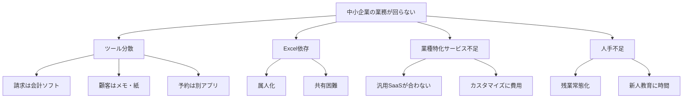
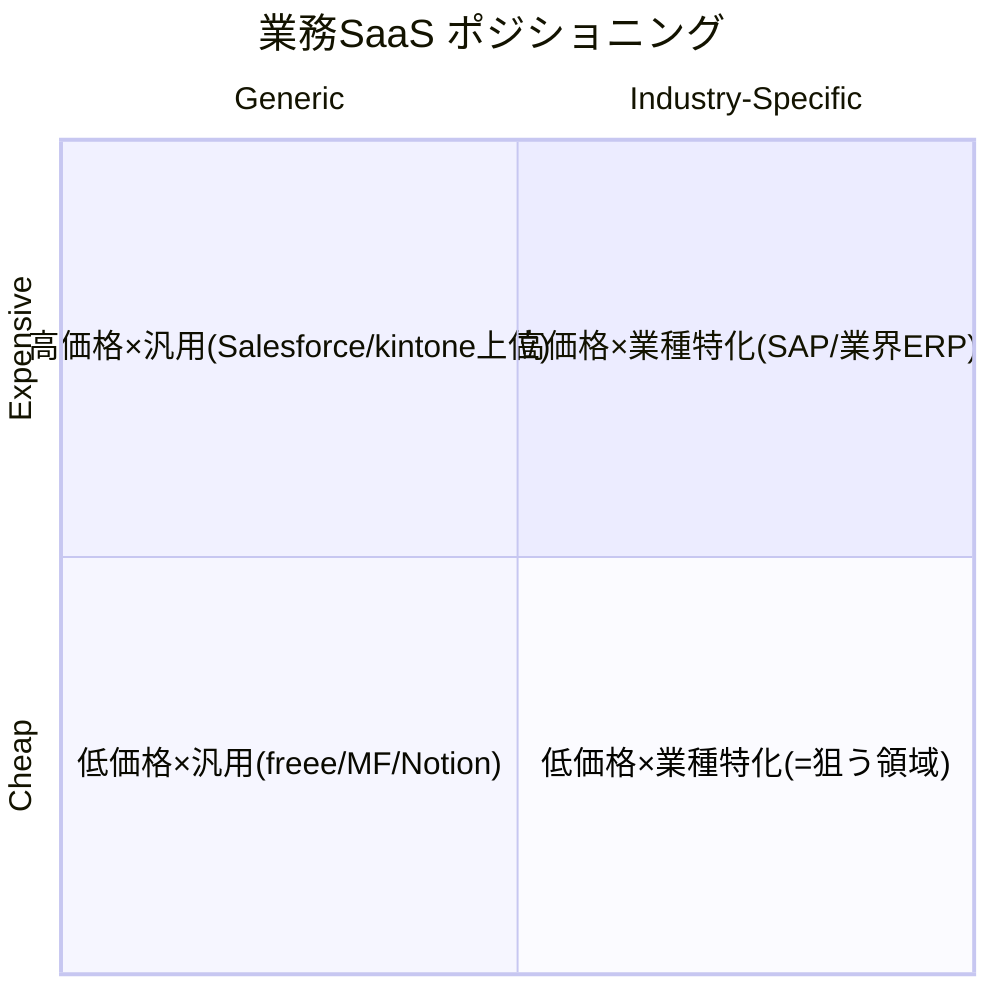
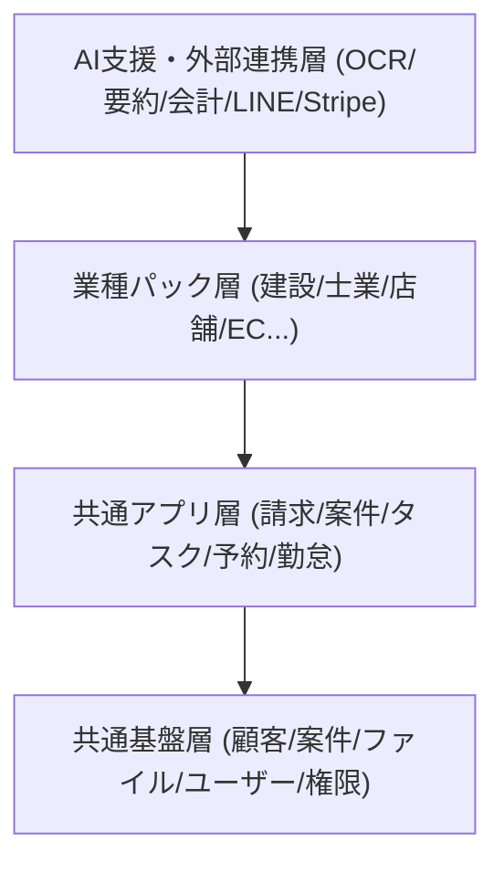
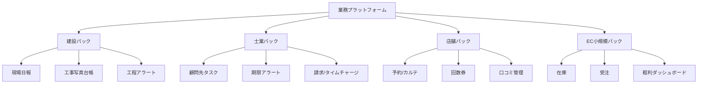
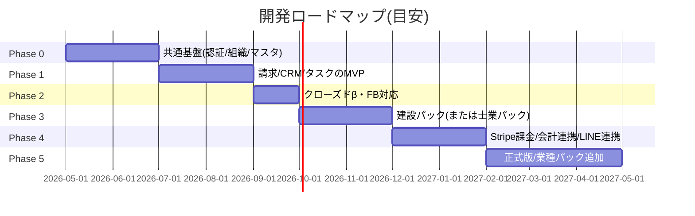
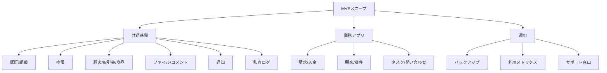
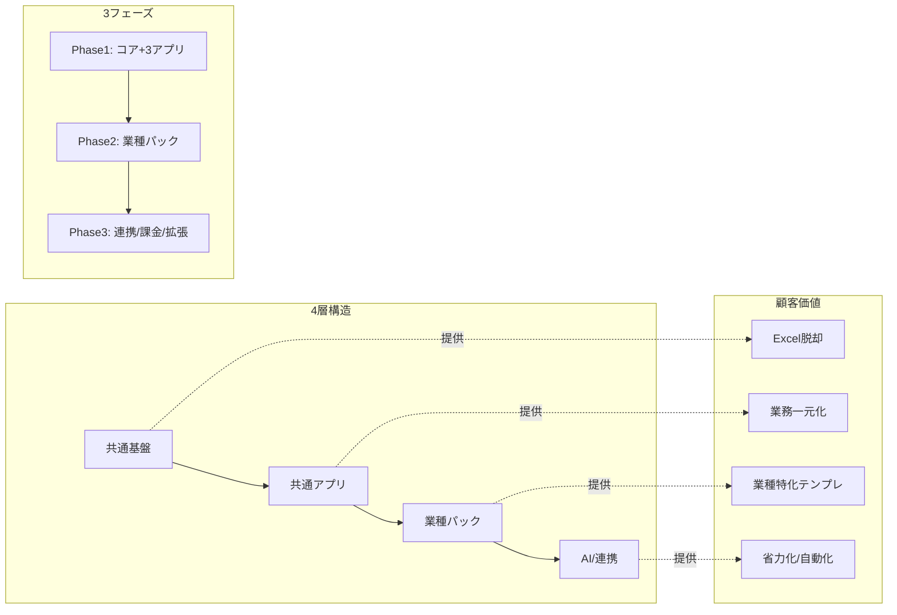

# 業務アプリプラットフォーム構想資料（ダイアグラム思考版）

- 作成日: 2026-05-04
- 対象: 個人事業主／中小企業向け業務アプリプラットフォーム
- 仮称（リポジトリ名候補）: `biz-suite` / `flowbase` / `deskline`

> 本書はダイアグラム思考の3ステップ（目的確認 → キーワード決定 → 図化と振り返り）に従って構成しています。各章は「コアメッセージ → 採用フレームワーク → 図 → 振り返り」の順で記載します。

---

## 0. 全体コアメッセージ

> **個人事業主・中小企業の散在した業務を「共通データ基盤＋業種別アプリ」で1つに束ね、データ連携と業種テンプレートで現場の手間を半減させるプラットフォームを作る。**

---

## 1. 課題構造（なぜ作るのか）

**コアメッセージ:** 中小企業の業務効率化が進まない原因は「ツールの分散」「Excel依存」「業種特化の不在」「人手不足」が同時に起きていることにある。

**採用フレームワーク:** 構成 / ツリー図（ロジックツリー）



**振り返り:**
- 空き: 「会計連携」「電子帳簿保存」「インボイス」など外部要因も別ツリーで分解する余地。
- 次論点: 4課題のうち、最初に解くべきは `ツール分散` と `Excel依存`。

---

## 2. ポジショニング（市場での位置）

**コアメッセージ:** 既存SaaSは「汎用×安い」か「業種特化×高い」に二極化しており、`業種特化×低価格` のゾーンが空いている。

**採用フレームワーク:** 比較 / 2軸図



**振り返り:**
- 空き: 第4象限が手薄。ここに「業種パック × 低価格」で参入する。
- 次論点: 最初に攻める業種を1〜2に絞る（建設・士業・店舗が候補）。

---

## 3. 価値ピラミッド（プロダクトの構造）

**コアメッセージ:** 共通基盤の上に共通アプリ、その上に業種パック、最上段にAI／連携を積み上げる4層構造で価値を提供する。

**採用フレームワーク:** 階層 / ピラミッド図



**振り返り:**
- 空き: 「データ分析/BI層」を将来段として独立させる検討余地。
- 次論点: どの層を内製、どの層をパートナー連携にするかの線引き。

---

## 4. ユーザー像と利用シーン（誰が何をする）

**コアメッセージ:** 経営者は「数字と期限」、現場は「日々の入力」、外部専門家は「資料の受け渡し」をこのプラットフォームで完結させる。

**採用フレームワーク:** 分類 / マトリクス図

| ロール | 主な目的 | よく使うアプリ | 重要な指標 |
|---|---|---|---|
| オーナー（経営者） | 数字と期限の把握 | 請求／資金繰り／契約期限 | 月次売上・未入金・更新期限 |
| 管理者 | 仕組みを回す | ユーザー／権限／マスタ／承認 | 申請件数・ボトルネック |
| 一般スタッフ | 日次の業務入力 | 案件／タスク／日報／勤怠 | 入力率・作業時間 |
| ゲスト顧客 | 請求・納品物確認 | 顧客ポータル | ログイン率 |
| 税理士・社労士 | 資料受領・質問 | 共有フォルダ／コメント | 月次提出完了 |

**振り返り:**
- 空き: 「LINEだけで使う現場アルバイト」など、ログイン不要の超軽量UXも検討余地。

---

## 5. アーキテクチャ全体像（モノとデータの流れ）

**コアメッセージ:** フロント・API・共通基盤・外部連携を疎結合にし、業務アプリは共通基盤を再利用する形で増設する。

**採用フレームワーク:** 相関 / モデル図

```mermaid
flowchart LR
    subgraph Client[クライアント]
        Web[Webブラウザ]
        Mobile[モバイル(PWA)]
    end

    subgraph Edge[エッジ/CDN]
        CDN[Vercel/Cloudflare]
    end

    subgraph App[アプリケーション層]
        UI[Next.js UI]
        API[REST/RPC API]
        Jobs[ジョブ/Cron/Queue]
    end

    subgraph Core[共通基盤]
        Auth[認証/組織/権限]
        Master[共通マスタ]
        Files[ファイル]
        Notify[通知]
        Audit[監査ログ]
    end

    subgraph Apps[業務アプリ群]
        Inv[請求]
        Crm[CRM]
        Tsk[タスク]
        Booking[予約]
        Site[現場日報]
    end

    subgraph Data[データ層]
        DB[(PostgreSQL)]
        Obj[(Object Storage)]
        Search[(検索)]
    end

    subgraph Ext[外部連携]
        Acc[会計(freee/MF)]
        Pay[Stripe]
        Line[LINE]
        Cal[Google Calendar]
        Mail[Gmail/Outlook]
    end

    Web --> CDN --> UI --> API
    Mobile --> CDN
    API --> Core
    API --> Apps
    Apps --> Core
    Core --> DB
    Core --> Obj
    Core --> Search
    Jobs --> API
    API --> Ext
    Ext --> API
```

**振り返り:**
- 空き: バックアップ／DR、ログ集約（Datadog等）の層が未記載。
- 次論点: 検索を初期からMeilisearchにするか、Postgres全文で粘るか。

---

## 6. データ連携モデル（中心は共通マスタ）

**コアメッセージ:** すべての業務アプリは「顧客／案件／ファイル／ユーザー」の共通マスタを介してデータを共有する。

**採用フレームワーク:** 相関 / モデル図（ハブ＆スポーク）

```mermaid
flowchart TD
    subgraph Hub[共通基盤(ハブ)]
        Customer[顧客]
        Project[案件]
        File[ファイル]
        User[ユーザー/権限]
        Activity[イベント/ログ]
    end

    Inv[請求アプリ] --> Customer
    Inv --> Project
    Inv --> File
    Crm[CRMアプリ] --> Customer
    Crm --> Project
    Booking[予約アプリ] --> Customer
    Booking --> User
    Site[現場日報] --> Project
    Site --> File
    Tsk[タスク] --> Project
    Tsk --> User
    Tsk --> Customer
    Activity --> Inv
    Activity --> Crm
    Activity --> Booking
    Activity --> Site
    Activity --> Tsk
```

**振り返り:**
- 空き: 「契約」「在庫」「商品」も中心マスタに昇格する候補。
- 次論点: マスタ統合のため、CSV/Webhook以外にWebUI上の「マスタ統合ツール」が必要。

---

## 7. アプリ追加の仕組み（モジュール拡張）

**コアメッセージ:** 各業務アプリはプラグイン的にON/OFFでき、業種パックでまとめて有効化される。

**採用フレームワーク:** 構成 / ツリー図



**振り返り:**
- 空き: 「複数パックを同時に使う事業者」（例：店舗＋EC）への対応指針が未定義。
- 次論点: パック同士のメニュー競合や用語統一ルール。

---

## 8. オンボーディング（ユーザーの導入プロセス）

**コアメッセージ:** 新規ユーザーは「業種選択 → 初期データ投入 → 連携設定 → 最初の業務完了」までを30分以内で終えるようにする。

**採用フレームワーク:** 推移 / プロセス図

```mermaid
flowchart LR
    S1[サインアップ] --> S2[業種パック選択]
    S2 --> S3[組織情報入力]
    S3 --> S4[CSV/手入力で顧客登録]
    S4 --> S5[会計/LINEなど連携設定(任意)]
    S5 --> S6[請求書1通の発行]
    S6 --> S7[完了/次のおすすめ表示]
```

**振り返り:**
- 空き: 「税理士・社労士の招待」をいつ案内するか、フローに組み込む余地。

---

## 9. 開発ロードマップ（時系列での価値提供）

**コアメッセージ:** 共通基盤 → 3アプリ → β → 業種パック → 連携／課金の順で、半年でβ、1年で正式版を出す。

**採用フレームワーク:** 推移 / プロセス図



**振り返り:**
- 空き: セキュリティ監査・脆弱性診断の時期が未配置。Phase 4 と Phase 5 の間に挿入が望ましい。

---

## 10. 課金プラン（4段階＋アドオン）

**コアメッセージ:** Free → Light → Standard → Business の4段にし、業種パックはアドオンとして上乗せする。

**採用フレームワーク:** 階層 / ピラミッド図

```mermaid
flowchart TD
    Top[Business: 監査ログ/SSO/SLA]
    Mid[Standard: 全アプリ・連携・15ユーザー]
    Low[Light: 3アプリ・5ユーザー]
    Base[Free: 共通基盤+1アプリ・1ユーザー]
    Top --> Mid --> Low --> Base
    AddOn[業種パック(建設/士業/店舗 etc.)]:::addon
    AddOn -.加算.-> Mid
    AddOn -.加算.-> Top
    classDef addon fill:#fff5d6,stroke:#d49a00;
```

**振り返り:**
- 空き: 「税理士・社労士向け無料招待」「複数組織管理プラン」を別軸で検討。

---

## 11. 機能スコープ分解（MVPで何を作るか）

**コアメッセージ:** MVPは「請求／顧客／タスク」を中心に、全社共通の `ファイル・通知・権限` を最小構成で揃える。

**採用フレームワーク:** 構成 / ツリー図



**振り返り:**
- 空き: モバイルUI（PWA）はMVP内かPhase2か、要判断。

---

## 12. リスクと対応

**コアメッセージ:** スコープ膨張・乗り換え障壁・法改正・大手競合の4リスクを、設計段階で抑え込む。

**採用フレームワーク:** 分類 / マトリクス図

| リスク | 影響 | 兆候 | 主な対応 |
|---|---|---|---|
| スコープ膨張 | リリース遅延 | 機能要望増・優先度紛糾 | パック単位で凍結／コア優先 |
| 乗り換え障壁 | 顧客獲得停滞 | 「データ移行が大変」声 | CSV入出力／移行支援メニュー |
| 法改正 | 監査・信頼問題 | インボイス・電帳法等 | 専任ロール／早期キャッチ／告知 |
| 大手競合 | 価格圧力 | freee/kintoneの中小強化 | 業種特化＋価格＋現場UX |

**振り返り:**
- 空き: セキュリティインシデント／円安によるクラウド料金高騰など外部リスクも別表に。

---

## 13. 成功指標（KPI）

**コアメッセージ:** 「契約数」「アプリ利用率」「連携接続率」「解約率」の4指標で健全性を判断する。

**採用フレームワーク:** 階層 / ピラミッド図

```mermaid
flowchart TD
    Top[北極星KPI: 月次有料テナント数]
    L1[ARPU/解約率]
    L2[主要アプリ(請求/案件/タスク)利用率]
    L3[連携接続率(会計/LINE/Stripe)]
    L4[サインアップ→課金転換率]
    Top --> L1
    L1 --> L2
    L2 --> L3
    L3 --> L4
```

**振り返り:**
- 空き: 顧客満足(NPS)・サポート負荷指標が抜けている。

---

## 14. 全体まとめ（ワンシート）

**コアメッセージ:** プラットフォームは「共通基盤 → 共通アプリ → 業種パック → AI/連携」の4層、3段階のフェーズで成長する。

**採用フレームワーク:** 構成 / モデル図



**振り返り:**
- 空き: パートナー（税理士・社労士・ITコーディネータ）への提供価値が未図示。次の構想資料V2では追加予定。

---

## 付録A. 用語ミニ辞書

- **共通基盤**: 顧客／案件／ファイル／ユーザー／通知などプラットフォーム全体で再利用するレイヤー。
- **業種パック**: 特定業種向けの初期データ・画面・帳票テンプレ一式。
- **マルチテナント**: 1つのシステムを複数組織が完全分離で使う方式。
- **RLS**: PostgreSQLの行レベルセキュリティ。`org_id` で別組織のデータを遮断する。
- **イベント連携**: 「請求書が発行された」などをWebhookで他機能・外部に通知する仕組み。

## 付録B. 次のアクション（推奨）

1. ターゲット業種を1〜2に確定（候補: 建設／士業／店舗）。
2. 共通基盤のER図V1を作成（顧客／案件／請求／ファイル中心）。
3. MVPの画面ワイヤーフレーム（ホーム／顧客／案件／請求／設定）。
4. 価格・プラン仮説の検証（5社程度のヒアリング）。
5. リポジトリ作成（候補名: `biz-suite` / `flowbase` / `deskline`）。
